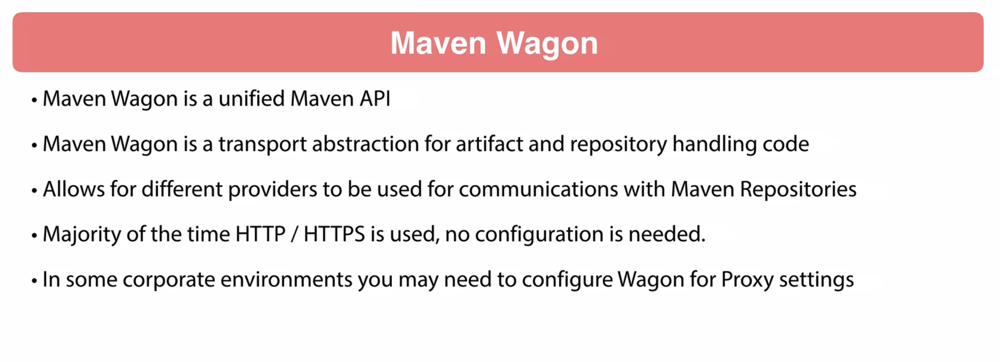

# Seciton 5: Maven Basics
## Maven Coordinates

## Maven Repositories

Snapshots dont get cached locally--maven will always look for a newer copy of it. Otherwise, it takes it and then never checks for that version again.

[Here's an example of the User Friendly Maven Central Repository GUI](https://mvnrepository.com/artifact/com.google.android.material/compose-theme-adapter-3/1.1.0)

## Maven Wagon

A layer of abstraction created by the Maven Team; but, it's so deep that people often don't need it.
If I ever need to do "something like a proxy"; I can look this up and use it. Otherwise, I'll probably just get on with my life. 

## Maven POM 'Project Object Model'

maven has a maven xsd file which says what is allowed to go into a POM.
This file is called "maven-4.0.0.xsd" and I can look at it if I want to get an idea for what mavan suports in a POM. 🤔

`mvn help:effective-pom` <-- Shows what POM arrises under the hood from the combination of all the children.

## Maven Dependencies

Interestingly, in cases where maven detects multiple versions of the same dependency scattered around the dependency tree, it tries to find "the closest" (i.e., the closest to the parent within the tree). Generally, this results in Shallower Dependencies winning out over deeper ones (I think?) but the Maven Guru says things can get funky. Generally, you get the latest version. 

"Runtime" scope is older--you would "Magically arive in your container and find that many of the artifacts upon which you depend were already waiting for you". Such an approach takes effort, however, and the industry is moving back towards self-contained packages. 

Make sure you don't forget to exclude things like "JUnit" or "Mockito" so that downstream consumers of your package don't need it.

"Import" --> Allows you to just say "Use that pom.xml over there for my project

`mvn dependency: tree, go-offline, purge-local-repository, sources`

## Maven Standard Directory Layout
