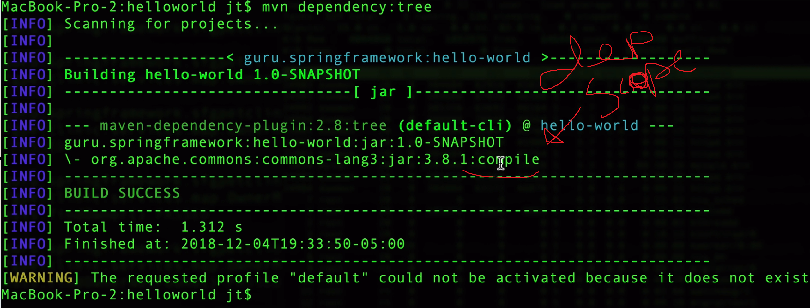
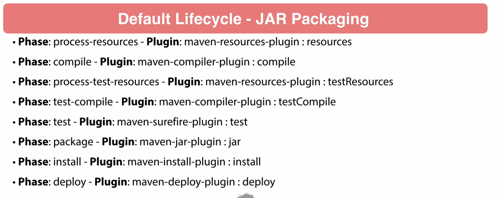

# Seciton 5: Maven Basics
## Maven Coordinates

## Maven Repositories

Snapshots dont get cached locally--maven will always look for a newer copy of it. Otherwise, it takes it and then never checks for that version again.

[Here's an example of the User Friendly Maven Central Repository GUI](https://mvnrepository.com/artifact/com.google.android.material/compose-theme-adapter-3/1.1.0)

## Maven Wagon

A layer of abstraction created by the Maven Team; but, it's so deep that people often don't need it.
If I ever need to do "something like a proxy"; I can look this up and use it. Otherwise, I'll probably just get on with my life. 

## Maven POM 'Project Object Model'

maven has a maven xsd file which says what is allowed to go into a POM.
This file is called "maven-4.0.0.xsd" and I can look at it if I want to get an idea for what mavan suports in a POM. 🤔

`mvn help:effective-pom` <-- Shows what POM arrises under the hood from the combination of all the children.

## Maven Dependencies

Interestingly, in cases where maven detects multiple versions of the same dependency scattered around the dependency tree, it tries to find "the closest" (i.e., the closest to the parent within the tree). Generally, this results in Shallower Dependencies winning out over deeper ones (I think?) but the Maven Guru says things can get funky. Generally, you get the latest version. 

"Runtime" scope is older--you would "Magically arive in your container and find that many of the artifacts upon which you depend were already waiting for you". Such an approach takes effort, however, and the industry is moving back towards self-contained packages. 

Make sure you don't forget to exclude things like "JUnit" or "Mockito" so that downstream consumers of your package don't need it.

"Import" --> Allows you to just say "Use that pom.xml over there for my project

`mvn dependency: tree, go-offline, purge-local-repository, sources`

## Maven Standard Directory Layout

 `src` files are typically organized by *language:* java, kotlin, etc. You can also view the: [Docs for standard Maven Directory Layout](https://maven.apache.org/guides/introduction/introduction-to-the-standard-directory-layout.html)

## Maven Build Lifecycles

Work done in maven is done by Plugins. Goals are inside Phases, and phases are inside the Lifecycle. 

|-------------------------------|
|Lifecycle                      |  
|     |------------------------ |  
|     |    Phase                |                   
|     |      |------------------|        
|     |      |    Goal          |           
|-----|-------------------------|

the 'clean' lifecycle has three phases: pre-clean, clean, and post-clean

We have the option to glue actions to each of these phases. Tons of stuff in the Default lifecycle.

(Less Common)

## Maven Wrapper
**Considered a Best Practice!**
You can distribute maven with your project using maven wrapper. This allows project-specific Maven artifacts (rather than just using whatever you IDE finds on the OS)

Using this allows your builds to be more portable. 
This might be worth coming back to in the future. 

Bascially, just look this up if you ever need it.  It's just more mvn commands to create. As long as java is installed, the build will run on new machines. 

This is useful for making the project more portable, either as a distributable project, or as a way to make deployments smoother. 

## Maven Archetypes

Many of these are out of date. Like "J2EE". 10 years dead. 
[Check out these archetypes if you're curious](https://maven.apache.org/archetypes/index.html)
FYI; 'archetype' is the plugin, and 'generate' is the goal. 

# Section 6: Common Maven Plugins
"Basically, maven is just a thing that runs plugins"

## Overview Maven Lifecycle Plugins

### DEFAULT LIFECYCLE PLUGINS

 --> Teacher Never had to touch this
 --> Important, seems to mostly handle testing. Also handles POJO tests; has default extensions it looks for. 
 - The jar plugin; probably don't need to worry about this one.

### 'SITE' LIFECYCEL PLUGINS
Probably not relevant to me. 

## Maven Clean Plugin
Run the regularly, especially while refactoring. This is because all the pre-refactor nonsense is still in the target directory, even after refactors have taken place. Whithout doing this, package will just take what's there (I think)

The above example is great; it shows how a projet can reference the `maven-clean-plugin` and then add a reference to the `<initialize>` phase before deciding to use a clean goal: `<goal>clean</goal>` 

